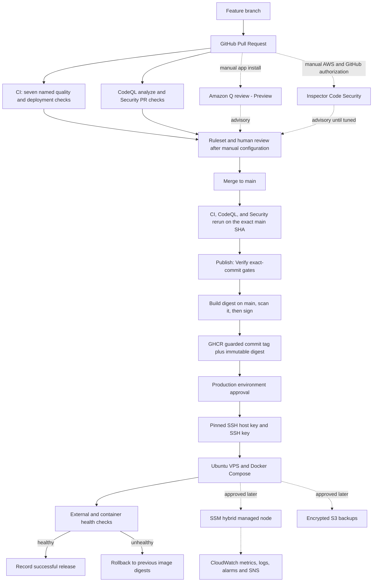

# معمارية AWS المقترحة لـSuperApp

تاريخ القرار: 2026-08-08

نقطة الأساس موثقة في `docs/INITIAL_AUDIT.md`. يصف هذا الملف ما يعمل فعلاً وما يُوصى به لاحقاً؛ كلمة «مقترح» لا تعني أن مورداً أُنشئ.

## القرار التنفيذي

يبقى الإنتاج على Ubuntu VPS الخارجي وDocker Compose. لا توجد فائدة تقنية تبرر نقل وقت التشغيل الآن إلى EC2 أو ECS أو EKS، كما أن ذلك خارج نطاق المهمة.

يبقى GHCR سجل الصور. الصور الحالية مبنية من المستودع، وموسومة بوسم commit، وموقعة بلا مفتاح دائم بواسطة Cosign وGitHub OIDC، ثم تُشغّل بالـdigest الذي جرى التحقق منه. إضافة ECR الآن ستكرر سجلاً يعمل وتضيف IAM وتكلفة ومسار فشل ثانياً بلا منفعة تشغيلية لازمة.

لا يوجد تكامل AWS أو مورد AWS مفعّل من هذه المهمة. أي مسار AWS مرسوم بخط متقطع أدناه هو مرحلة لاحقة تتطلب أولاً تأمين حساب الجذر، وهوية بشرية غير جذرية، وموافقة تكلفة.

[GitHub Packages: public packages are free](https://docs.github.com/en/packages/learn-github-packages/introduction-to-github-packages#about-billing-for-github-packages)

## البنية الحالية

- مونوريبو يديره `pnpm 11.9.0` وTurbo ويُبنى على Node.js 22.

- `apps/api` هو NestJS 11 مع Drizzle وPostgreSQL 17/PostGIS وSocket.io.

- `apps/admin` هو Next.js 15 وReact 19.

- `apps/customer` و`apps/vendor` و`apps/driver` تطبيقات Expo، ويوجد عميل Flutter إضافي في `apps/driver_flutter`.

- Caddy هو المدخل العام الوحيد على المنفذين 80 و443. قاعدة البيانات والـAPI ولوحة الإدارة لا تنشر منافذها مباشرة إلى الإنترنت.

- لكل من الإنتاج والتجربة حاويات وأحجام وشبكات داخلية مستقلة. Caddy وحده يصل إلى شبكتي الحافة المنفصلتين.

- صور `superapp-api` و`superapp-admin` منشورة في GHCR، مع SBOM وprovenance وتوقيع Cosign على digest.

## قرار التقنية المستهدف

الحالة الحالية مختلطة: تطبيقات `customer` و`vendor` و`driver` مبنية بـExpo، ويوجد تطبيق سائق إضافي مبني بـFlutter. الـAPI ولوحة الإدارة والويب والحزم المشتركة مبنية بـTypeScript.

التوصية القوية هي `USE LATER`: توحيد جميع تطبيقات الهاتف على Flutter، مع إبقاء backend والويب ولوحة الإدارة على TypeScript. يقلل ذلك ازدواج منصتي الهاتف، ويجعل عقد OpenAPI وتوليد نماذج Dart الحد الواضح بين الهاتف والخادم.

هذا هدف معماري لا هجرة منفذة. لم تُحذف تطبيقات Expo ولم تُنقل شاشة أو ميزة في هذه المهمة. التنفيذ المستقبلي يحتاج ADR منفصلاً، وجرد تكافؤ للميزات، وتجربة تطبيق واحدة، وقياس build/release، وانتقالاً مرحلياً مع قدرة عودة؛ لا ينفذ كتغيير شامل داخل مهمة تقوية البنية.

## المسار النهائي المقترح



## تقييم خدمات AWS

التصنيف هنا قرار معماري، وليس بيان تفعيل. `USE NOW` يعني أول مورد ينبغي اعتماده بعد إغلاق بوابة هوية AWS والتكلفة؛ لا يعني أنه موجود اليوم.

### USE NOW

- **Amazon S3**: مخزن خارج الخادم لنسخ PostgreSQL ونسخ الإعدادات المشفرة من جهة العميل. يجب أن يكون في `eu-north-1` مع Block Public Access وVersioning وSSE-S3 وLifecycle. التصميم الكامل واختبار الاستعادة في `docs/DISASTER_RECOVERY.md`.

[AWS: S3 encryption](https://docs.aws.amazon.com/AmazonS3/latest/userguide/UsingEncryption.html)

[AWS: S3 Block Public Access](https://docs.aws.amazon.com/AmazonS3/latest/userguide/access-control-block-public-access.html)

### USE LATER

- **Amazon CloudFront**: يوضع أمام الأصول العامة أو Caddy فقط عندما تثبت القياسات حاجة CDN أو عندما يكون WAF مطلباً. لا يُضاف لمجرد تغيير المزوّد.

- **Amazon Route 53**: يُستخدم إذا تقرر نقل إدارة DNS أو إضافة health check مستقل. نقل DNS ليس شرطاً للمراقبة الحالية ولا يجوز تنفيذه بلا خطة TTL وعودة.

- **AWS WAF**: لا يرتبط مباشرة بـVPS خارجي؛ يحتاج مورداً مدعوماً مثل CloudFront أو ALB أو API Gateway. لذلك يأتي بعد قرار CloudFront فقط.

[AWS WAF: resources that can be protected](https://docs.aws.amazon.com/waf/latest/developerguide/how-aws-waf-works-resources.html)

- **Amazon SES**: يصبح مناسباً عند وجود بريد معاملات فعلي مثل التحقق أو الإيصالات. لا يوجد مسار إرسال بريد مثبت في الشيفرة الحالية.

- **Amazon SQS**: مناسب عندما تظهر أعمال غير متزامنة تحتاج retry وDLQ، مثل الإشعارات أو التسويات. الخدمة الحالية لا تحتاج طابور AWS لإتمام مسارها الأساسي.

- **Amazon EventBridge**: مفيد لاحقاً لأحداث AWS التشغيلية، مثل فشل النسخ أو استعمال root، بعد وجود موارد AWS فعلية. لا يُدخل كناقل لأحداث التطبيق الحالية.

- **Amazon RDS for PostgreSQL**: مرشح مستقبلي إذا أصبحت إدارة PostgreSQL على VPS عبئاً مثبتاً وكانت تكلفة الشبكة والترحيل مقبولة. ليس جزءاً من هذه المهمة، ولا تغيّر قاعدة الإنتاج الآن.

- **AWS Secrets Manager**: يستخدم عندما يصبح للـVPS هوية SSM هجينة مستقرة وتوجد خطة جلب وcache وعودة للأسرار. حالياً تقرأ الحاويات ملف بيئة محلياً؛ نقل السر دون تغيير مسار الاستهلاك لا يحسن شيئاً. السعر المنشور يبدأ من `0.40 USD` لكل secret شهرياً، إضافة إلى API calls.

[AWS Secrets Manager pricing](https://aws.amazon.com/secrets-manager/pricing/)

### NOT NEEDED

- **AWS Shield**: Shield Standard يفيد الموارد المدعومة داخل AWS ولا يحمي عنوان VPS الخارجي. Shield Advanced غير متناسب مع الحجم الحالي، وسعر الاشتراك الأساسي المنشور هو `3,000 USD/month` قبل رسوم نقل أو خدمات أخرى.

[AWS Shield pricing](https://aws.amazon.com/shield/pricing/)

- **Amazon ElastiCache**: لا توجد حالياً قياسات تثبت عنق قراءة، ولا جلسات خادمية، ولا lock موزع يحتاج Redis أو Valkey. يعاد تقييمه فقط بعد profiling.

- **Amazon ECR**: GHCR الحالي يحقق سجل الصور والتكامل مع GitHub والتوقيع والـdigest. لا يُضاف ECR إلا إذا نُقل runtime إلى AWS أو ظهرت متطلبات خاصة بسجل AWS.

- **Amazon ECS**: يعني تغيير منصة التشغيل، مع أنه لا توجد حاجة تبرر ترك VPS في هذه المرحلة.

- **Amazon EKS**: غير مطلوب. يضيف Kubernetes وcontrol plane وشبكات وتشغيل دائم إلى تطبيق يمكن تشغيله بوضوح عبر Compose.

- **Amazon Bedrock**: لا توجد وظيفة منتج تحتاج نموذجاً توليدياً. Amazon Q Developer وAgent Toolkit أدوات تطوير منفصلة، ولا يتطلبان إضافة Bedrock إلى التطبيق.

## حدود IAM

### البشر

تُوقف كل تغييرات AWS ما دامت الجلسة هي root وما دام MFA للجذر غير مفعّل.

الترتيب الآمن هو تفعيل أكثر من جهاز MFA للجذر، وتجنب access keys للجذر، ثم إنشاء هوية إدارية يومية عبر IAM Identity Center مع MFA وبيانات مؤقتة. يستخدم root للمهام التي تتطلبه فقط.

[AWS: root user best practices](https://docs.aws.amazon.com/IAM/latest/UserGuide/root-user-best-practices.html)

[AWS: IAM security best practices](https://docs.aws.amazon.com/IAM/latest/UserGuide/best-practices.html)

### GitHub Actions

لا يحتاج خط النشر الحالي دور AWS؛ فهو ينشر إلى GHCR ويتصل بـVPS عبر SSH. لذلك لا يُنشأ OIDC provider أو IAM role «احتياطاً».

إذا أضيف مورد AWS لاحقاً، تُنشأ أدوار منفصلة حسب القدرة ولا يجمع دور واحد النشر والنسخ والمراقبة:

- دور نشر ECR مستقبلي، إن اعتمد ECR، يسمح بالدفع إلى مستودعي الصور المحددين فقط ويثق بفرع `main`.

- دور إنتاج AWS مستقبلي يثق ببيئة GitHub المسماة `production` فقط، لا بأي فرع أو PR.

- دور القراءة أو التخطيط لا يكتب موارد، ولا يُعطى أبداً لتشغيل `pull_request` قادم من fork.

يجب أن يكون `aud` مساوياً لـ`sts.amazonaws.com` وأن يكون `sub` محدداً تماماً، مثل:

```text
repo:m7hm4d/superapp:environment:production
```

أو لدور نشر مقيد بالفرع:

```text
repo:m7hm4d/superapp:ref:refs/heads/main
```

[AWS: GitHub OIDC trust conditions](https://docs.aws.amazon.com/IAM/latest/UserGuide/id_roles_create_for-idp_oidc.html#idp_oidc_Create_GitHub)

[GitHub: OIDC security reference](https://docs.github.com/en/actions/reference/security/oidc)

### VPS والمراقبة والنسخ

بعد الموافقة، يسجل VPS كـSSM hybrid managed node بدور خدمة يثق بـ`ssm.amazonaws.com`. يضم الدور فقط قنوات SSM، وإرسال مجموعة metrics/logs المحددة، وكتابة prefix النسخ المحدد في S3. يكون دور الاستعادة البشري منفصلاً ويملك القراءة دون أن يمنحها لعملية النسخ اليومية.

لا توضع activation code أو SSH key أو مفاتيح AWS دائمة في GitHub أو على صورة الحاوية. تنتهي activation بعد تسجيل عقدة واحدة، وتستخدم العقدة بيانات الدور المؤقتة.

[AWS: hybrid and multicloud managed nodes](https://docs.aws.amazon.com/systems-manager/latest/userguide/systems-manager-hybrid-multicloud.html)

## المراقبة المقترحة للـVPS الخارجي

لا توجد مراقبة AWS مفعّلة الآن. المرحلة الدنيا المقترحة بعد الموافقة:

1. تسجيل الخادم بعقدة SSM hybrid باسم واضح ووسوم `Application=superapp` و`Environment=production`.

2. تثبيت CloudWatch Agent الموحد وإرسال metrics أساسية فقط: CPU، RAM، disk usage، inodes، swap، وحالة العمليات الحرجة.

3. إرسال سجلات Caddy وAPI والنشر مع retention من 14 إلى 30 يوماً، مع حجب الأسرار والـAuthorization headers قبل الإرسال.

4. تنبيهات قليلة قابلة للتصرف: API غير سليم، قرص أعلى من 85%، RAM أعلى من 90% مدة مستمرة، غياب metrics، فشل نسخة، وفشل نشر.

5. SNS بريد واحد للتنبيهات الحرجة، مع اختبار دوري لوصول الرسالة.

6. health check خارجي مستقل لاحقاً؛ فحص يجري من الخادم نفسه لا يكشف انقطاع الشبكة أو DNS.

[AWS: start CloudWatch Agent on an on-premises server](https://docs.aws.amazon.com/AmazonCloudWatch/latest/monitoring/start-CloudWatch-Agent-on-premise-SSM-onprem.html)

[AWS Systems Manager pricing](https://aws.amazon.com/systems-manager/pricing/)

[Amazon CloudWatch pricing](https://aws.amazon.com/cloudwatch/pricing/)

في 2026-08-08 لا توجد رسوم تسجيل أو رسوم لكل عقدة SSM هجينة، كما أن Session Manager وRun Command في الفترة الانتقالية بلا رسوم حتى 2026-09-30. بعد ذلك السعر المنشور هو `0.05 USD` للجلسة و`0.002 USD` لاستدعاء Run Command. تبقى CloudWatch وSNS وS3 محسوبة حسب الاستخدام.

## حماية التكلفة

قبل إنشاء S3 أو Inspector أو CloudWatch:

- أنشئ monthly cost budget بمبلغ صغير متفق عليه، مع تنبيهات عند 50% و80% و100%، وتنبيه forecast عند 100%.

- أرسل التنبيه إلى بريد مسؤول غير مرتبط فقط بصندوق root.

- فعّل AWS Cost Anomaly Detection مع AWS Services monitor وتنبيه يومي منخفض مناسب لحساب صغير. يحتاج النظام حتى 24 ساعة للبدء، وقد يحتاج إلى 10 أيام من استعمال خدمة جديدة لبناء التاريخ؛ ليس قاطع دائرة لحظياً.

- لا تضف budget action يوقف موارد الإنتاج آلياً. التنبيه يطلب مراجعة بشرية؛ الإيقاف التلقائي قد يحول زيادة كلفة صغيرة إلى outage.

- راجع التكلفة بعد أول أسبوع وبعد أول شهر، واضبط retention وحجم logs وفق القياس الفعلي.

[AWS Budgets pricing](https://aws.amazon.com/aws-cost-management/aws-budgets/pricing/)

[AWS: Cost Anomaly Detection](https://docs.aws.amazon.com/cost-management/latest/userguide/getting-started-ad.html)

مراقبة Budgets بلا actions مجانية، وأول ميزانيتين action-enabled مجانيتان وفق السعر المنشور؛ كل budget إضافية ذات actions تكلف `0.10 USD/day`. Cost Anomaly Detection نفسها بلا رسم إضافي، لكن SNS أو CloudWatch المرتبطين بها قد يولدان رسوماً حسب الاستخدام.

## تقدير شهري

هذه تقديرات تخطيطية قبل الضرائب ونقل البيانات، وليست فاتورة أو عرض سعر. يجب إعادة حسابها في AWS Pricing Calculator قبل الموافقة.

### الحالة المنفذة الآن

- موارد AWS المنشأة أو المعدلة: لا شيء.

- التكلفة الإضافية من AWS لهذه المهمة: `0 USD/month`.

- AWS CLI وAgent Toolkit المحليان لا يثبتان بحد ذاتهما مورداً سحابياً.

### الحد الأدنى المقترح

الافتراض: عقدة VPS واحدة، حتى 10 custom metrics، حتى 10 alarm metrics، أقل من 5 GB logs شهرياً، ونسخ مضغوطة مجموعها 40 إلى 80 GB في S3.

- CloudWatch يقع غالباً داخل الحصة المجانية المنشورة لهذه الحدود؛ أي تجاوز يحسب بسعر `eu-north-1`.

- SSM: `0 USD` في الفترة الانتقالية الحالية. بعد 2026-09-30، أربع جلسات و30 Run Commands شهرياً تساوي تقريباً `0.26 USD`.

- S3 والطلبات: تقريباً `1–3 USD/month` لهذا الحجم، مع زيادة الاستعادة ونقل البيانات عند وقوع disaster.

- SNS email منخفض الحجم يقع عادة ضمن الحصة المجانية.

المجموع التخطيطي: نحو `1–4 USD/month`، ثم يعاد ضبطه بعد قياس حجم النسخة والسجلات.

### مع Inspector Code Security

سعر `eu-north-1` المتحقق من AWS Price List هو `0.18 USD` لكل نوع تحليل ولكل وحدة repository بحجم 10 MB. لمستودع يقع في وحدة واحدة، وثلاثة أنواع تحليل، وفحص أولي، وأربعة فحوص أسبوعية، وخمس PRs تُفتح ثم تُدمج في الشهر:

```text
(1 initial + 4 periodic + 5 PR + 5 merge/push) x 3 scan types x 0.18 USD = 8.10 USD/month
```

يزداد الرقم خطياً إذا تجاوز حجم المستودع 10 MB أو زاد عدد PRs. توجد تجربة مجانية لمدة 15 يوماً للحسابات الجديدة على Inspector.

مع الحد الأدنى المقترح أعلاه يصبح الإجمالي التخطيطي نحو `9.10–12.10 USD/month` بعد انتهاء التجربة، قبل الضرائب ونقل البيانات وأي تجاوز للحصص. ينخفض إذا كانت أحداث الدمج أقل أو تخطى Inspector commit غير متغير.

[Amazon Inspector pricing](https://aws.amazon.com/inspector/pricing/)

### خدمات اختيارية غير معتمدة

إذا أضيف Route 53 health check إلى endpoint خارج AWS، يبدأ السعر المنشور للفحص الأساسي من `0.75 USD/month`؛ وقد تضيف خصائص مثل HTTPS أو string matching `2.00 USD/month` لكل خاصية. لا تشمل هذه الأرقام نقل DNS أو رسوم النطاق.

[Amazon Route 53 pricing](https://aws.amazon.com/route53/pricing/)

CloudFront وWAF وSecrets Manager غير داخلة في سيناريو `1–4 USD/month`. تعتمد كلفة CloudFront وWAF على الطلبات وحجم البيانات والقواعد، بينما تكلف خمسة secrets في Secrets Manager نحو `2 USD/month` قبل API calls. لا ينشأ أي منها لمجرد توفر ميزانية.

## ترتيب التبني

1. تفعيل MFA للجذر وإنشاء هوية IAM Identity Center غير جذرية، ثم التحقق أن هوية CLI ليست root.

2. إنشاء Budget وCost Anomaly monitor قبل أي مورد ذي رسوم.

3. اعتماد S3 للنسخ، وتنفيذ restore drill معزول قبل اعتبار النسخ مكتملة.

4. تسجيل VPS عبر SSM hybrid وإرسال أقل مجموعة CloudWatch مفيدة، ثم قياس التكلفة والضجيج أسبوعاً.

5. تثبيت Amazon Q GitHub وInspector يدوياً إذا وافق المالك على صلاحيات التطبيقات والتكلفة، ثم التحقق على PR آمن.

6. إعادة تقييم CloudFront وRoute 53 وWAF فقط من قياسات أو مطلب أمني جديد.
