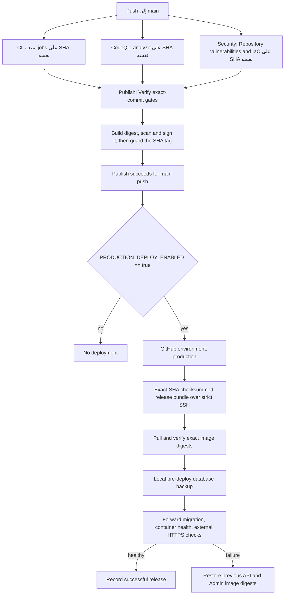

# دليل النشر إلى الإنتاج

تاريخ المراجعة: 2026-08-08

## الحالة الحالية

يوجد في هذا الفرع مسار نشر محمي إلى Ubuntu VPS الخارجي، لكنه غير مفعّل تشغيلياً بعد. لم تُنشأ GitHub Environment باسم `production`، ولم تُضبط أسرارها أو متغيراتها، ولم يثبت تشغيل إنتاج ناجح من `main`.

يتوقف job النشر ما لم تكن قيمة repository variable التالية مطابقة تماماً للنص `true`:

```text
PRODUCTION_DEPLOY_ENABLED
```

إبقاء المتغير غائباً أو بقيمة غير `true` هو وضع الإطلاق الآمن. لا يحتاج هذا المسار إلى AWS credentials، ولا يعني وجوده أن GitHub مرتبط بـAWS.

## المسار المنفذ في المستودع



فحص `Verify exact-commit gates` في `Publish` يقرأ تشغيلات GitHub Actions الخاصة بالـSHA نفسه، ولا يكتفي بآخر تشغيل أخضر. يتطلب نجاح تشغيل push إلى `main` لكل من jobs التالية:

```text
test
lint
contract
deploy
expo (customer)
expo (vendor)
expo (driver)
analyze
Repository vulnerabilities and IaC
```

وسم يدوي أو تشغيل يدوي لا يتجاوز هذه البوابة. بعد نجاح `Publish` من push إلى `main` فقط، يبدأ workflow باسم `Deploy Production` عبر `workflow_run`. اسم job هو:

```text
Deploy immutable image to production
```

## إعداد GitHub اليدوي

لا يستطيع commit إنشاء حماية Environment أو قيم الأسرار والمتغيرات. ينفذ مالك المستودع هذه الخطوات يدوياً ثم يعيد التحقق منها من GitHub.

### Environment

أنشئ Environment بالاسم الدقيق:

```text
production
```

اضبط، عند توفر مراجع ثانٍ، مراجعاً مطلوباً واحداً على الأقل مع `Prevent self-review`. قيد فروع النشر إلى `main`، وامنع bypass الإداري إن كانت خطة GitHub تسمح. لا تفعّل النشر قبل نجاح تجربة staging موثقة.

[GitHub: deployment environments and protection rules](https://docs.github.com/en/actions/reference/workflows-and-actions/deployments-and-environments)

### أسرار Environment

يحتاج workflow الاسمين التاليين فقط كأسرار Environment:

```text
PRODUCTION_SSH_PRIVATE_KEY
PRODUCTION_SSH_KNOWN_HOSTS
```

يكون المفتاح الخاص لمستخدم نشر مخصص غير root، ولا يشارك مع حساب شخصي. صلاحية Docker تعادل عملياً root على الخادم، لذلك يقيد الحساب والمفتاح إلى هذا الخادم والغرض، وتراجع مفاتيح `authorized_keys` دورياً.

تحتوي قيمة `PRODUCTION_SSH_KNOWN_HOSTS` على host key ثابتاً جرى التحقق من بصمته خارج قناة SSH نفسها. لا تنشئه داخل CI بواسطة `ssh-keyscan` من دون مقارنة موثوقة. للمنفذ غير 22 يجب أن يطابق السجل الصيغة التالية:

```text
[host.example.com]:2222
```

لا تضع password أو AWS access key أو ملف البيئة الكامل في GitHub.

### متغيرات Environment

يحتاج workflow القيم التالية:

```text
PRODUCTION_HOST
PRODUCTION_SSH_PORT
PRODUCTION_SSH_USER
PRODUCTION_APP_PATH
PRODUCTION_API_URL
PRODUCTION_ADMIN_URL
```

`PRODUCTION_HOST` اسم مضيف أو عنوان صالح بلا protocol، و`PRODUCTION_SSH_PORT` رقم من 1 إلى 65535، و`PRODUCTION_SSH_USER` اسم مستخدم Linux مخصص، و`PRODUCTION_APP_PATH` مسار مطلق ثابت لحالة التطبيق وملف البيئة وحزم الإصدارات على الخادم.

يجب أن يكون `PRODUCTION_API_URL` و`PRODUCTION_ADMIN_URL` أصلي HTTPS بلا userinfo أو path أو query، مثل:

```text
https://api.example.com
https://admin.example.com
```

المتغير الوحيد على مستوى repository هو مفتاح الإتاحة:

```text
PRODUCTION_DEPLOY_ENABLED=false
```

غيّره إلى `true` فقط بعد إكمال قائمة القبول أدناه. لا توجد قيمة افتراضية تسمح بالنشر.

## تجهيز VPS

المتطلبات التشغيلية:

- Ubuntu مدعوم ومحدّث أمنياً، وDocker Engine مع Compose plugin.

- `cosign` و`curl` و`flock` و`sha256sum` مثبتة ومثبتة المصدر أو الحزمة.

- مجلد تطبيق ثابت في `PRODUCTION_APP_PATH` يملكه مستخدم النشر، وفيه ملف `.env.prod` ومجلدا `.deploy` و`.releases` المحميان.

- ملف `.env.prod` خارج Git بصلاحية `0600` ومجلده غير قابل للكتابة لمستخدمين آخرين.

- شبكة حافة باسم مشتق من `STACK_NAME`، وحزمة Caddy العاملة متصلة بها.

- مساحة قرص تكفي للصور الحالية والسابقة ونسخة PostgreSQL محلية قبل كل نشر وحزم `.releases` المحفوظة.

- وصول سحب إلى GHCR. الصور العامة لا تحتاج token دائم؛ إذا أصبحت الحزمة خاصة، يستخدم credential قراءة محدوداً ويدوّر دورياً.

لا يعتمد workflow على checkout قديم في VPS. يفحص commit الذي بناه `Publish` نفسه على runner، وينشئ bundle محدودة تضم `docker-compose.prod.yml` وسكربتات النشر والنسخ والتحقق وmanifest SHA-256. ينقل archive وchecksum الخارجي عبر SSH، ويرفض أي path إضافي داخلها، ثم يتحقق من manifest الداخلي.

يضع workflow عمليات الإنتاج في `concurrency.queue: max` بدلاً من pending واحدة قابلة للاستبدال، ثم يرفض حدث `workflow_run` المتأخر إذا لم يعد source SHA هو رأس `main` الحالي، ويعيد الفحص مباشرة قبل تشغيل العملية البعيدة. يمنع ذلك أن يلغي اكتمال قديم عملية أحدث تنتظر، أو أن ينشر اكتمال بطيء نسخة أقدم فوق نسخة أحدث. حد GitHub المنشور للصف هو 100؛ إذا امتلأ يلزم تدخل تشغيلي ولا يجوز اعتبار run الملغاة نشراً ناجحاً. العودة المقصودة إلى إصدار سابق تبقى إجراءً يدوياً صريحاً، لا نتيجة ترتيب أحداث Actions.

[GitHub: queue multiple pending workflow runs](https://docs.github.com/en/actions/how-tos/write-workflows/choose-when-workflows-run/control-workflow-concurrency)

تثبت الحزمة في المسار التالي بصلاحيات قراءة وتنفيذ مقيدة:

```text
${PRODUCTION_APP_PATH}/.releases/<full-40-hex-source-sha>/
```

إذا كان مجلد SHA نفسه موجوداً، لا يعاد استخدامه إلا إذا طابق manifest والchecksums تماماً. يشغل workflow السكربت من release directory، لكنه يمرر ملف البيئة والحالة الدائمين:

```text
--env ${PRODUCTION_APP_PATH}/.env.prod
DEPLOY_STATE_DIR=${PRODUCTION_APP_PATH}/.deploy
```

لا توجد بعد سياسة تنظيف آلية لمجلد `.releases`. راقب حجمه ولا تحذف release الحالية أو release لازمة لتشخيص حادث من دون تحقق.

يشغل launcher البعيد النشر تحت `nohup` في run directory خاصة، ويسجل PID وstatus وheartbeat ذرية. ينتظر workflow إثبات حالة `running` وهوية العملية، ثم يراقب حياتها والheartbeat حتى terminal status. انقطاع اتصال runner لا يقتل سكربت النشر البعيد في منتصف العودة، لكن انقطاع طاقة VPS أو تلف القرص يبقى حادثاً يحتاج runbook ولا تحوله `nohup` إلى نجاح.

## تجربة staging قبل الإنتاج

ابدأ باختبار السلامة المحلي:

```bash
./deploy/test-deployment-safety.sh
```

استخدم بيئة staging منفصلة ووسم SHA ثابتاً منشوراً وموقعاً:

```bash
./deploy/deploy.sh \
  --env .env.stage \
  --expected-stack stage \
  --api-url https://api-stage.example.com \
  --admin-url https://admin-stage.example.com \
  sha-0123456789abcdef0123456789abcdef01234567
```

الواجهة المقبولة للسكربت هي:

```text
./deploy/deploy.sh [--env FILE] [--expected-stack NAME] [--api-url HTTPS_ORIGIN --admin-url HTTPS_ORIGIN] TAG
./deploy/deploy.sh [--env FILE] [--expected-stack NAME] [--api-url HTTPS_ORIGIN --admin-url HTTPS_ORIGIN] --tag TAG
```

يقبل `sha-` متبوعاً بالـ40 محرفاً السداسياً الصغيرة الكاملة للـGit commit فقط. يرفض SHA القصيرة و`latest` وكل وسوم SemVer وغياب الوسم أو تعدده. GitHub Release قد يشير إلى digest معتمد للعرض، لكنه ليس مدخلاً للنشر. أي مثال قديم يشغل `./deploy/deploy.sh` بلا TAG أو بـ`vX.Y.Z` سيفشل عمداً ويجب تحديث أمر التشغيل، لا إعادة قيمة `latest` الافتراضية.

عند push إلى `main` يبني `Publish` أولاً digest بلا tag، ثم يفحصها ويطابق label باسم `org.opencontainers.image.revision` ويوقعها، وبعد ذلك فقط ينشئ `sha-<40-hex>` مرة واحدة. لا ينشر `latest`. إعادة تشغيل workflow تستعمل وسم SHA الموجود فقط بعد إعادة إثبات revision وتوقيع `publish.yml@refs/heads/main` و`--certificate-github-workflow-sha`، ولا تحركه إلى rebuild جديد.

إنشاء Git tag لا يشغل workflow. ترقية إصدار موجود تتم يدوياً من النسخة الحالية الموثوقة على `main` بعد إنشاء tag مستقر:

```bash
gh workflow run publish.yml --ref main -f release_tag=v1.2.3
```

يتحقق التشغيل أن Git tag موجود وأن commit الخاص به ancestor لـ`main` وأن بوابات ذلك SHA نجحت. بعد ذلك يتحقق read-only من صورتي `sha-<40-hex>`: الـdigest وOCI revision وتوقيع `main` وworkflow SHA، ثم يعيد قراءة Git tag من GitHub مباشرة قبل إنشاء GitHub Release. لا ينشئ `vX.Y.Z` أو أي SemVer alias في GHCR؛ ملاحظات الإصدار تسجل الـdigestين فقط، والنشر يستعمل SHA الكامل. إعادة التشغيل تقبل GitHub Release الموجود فقط إذا طابق الاسم وGit tag والمصدر والنص والـdigests ولم يحوِ assets؛ وإلا تفشل بلا overwrite.

يجب حماية Git tags المطابقة لـ`v*` بقواعد تمنع update وdelete وforce-push إلا عبر حساب break-glass مراقب. فحوص workflow قبل الإنشاء وبعده تقلص السباق، لكن ruleset هو الذي يجعل tag غير قابل للحركة تشغيلياً.

## ما يفعله `deploy.sh`

1. يرفض root وملف environment غير المملوك لمستخدم النشر أو المكشوف للمجموعة/الآخرين أو symlink. يأخذ snapshot واحدة بصلاحية `0600` داخل state directory، يثبت metadata وSHA-256 قبلها وبعدها، ويستعملها في كل عمليات Compose والنسخ والهجرة ثم يحذفها عند الخروج.

2. يقرأ `STACK_NAME` واحدة من snapshot ويطابقها مع `--expected-stack` إن مررت، ثم يثبت Compose project صراحة، ويمسح متغيرات `COMPOSE_*` وقيم الاستيفاء الحساسة الموروثة، ويأخذ lock للحزمة كي لا يتداخل نشران.

3. يحلل ناتج `docker compose config` بلا طباعة أسرار، ويثبت قبل أي لمس لقاعدة البيانات أن `DATABASE_URL` لخدمة migrate تشير إلى `db:5432` وأن user/password/database تطابق `POSTGRES_*`. بذلك لا يمكن أخذ backup محلية ثم ترحيل قاعدة خارجية أو مختلفة بصمت.

4. يلتقط RepoDigests الفعلية لحاويتي API وAdmin العاملتين، ويقبلها للعودة الآلية فقط إذا كانتا من SHA واحد ونجح تحقق توقيعهما الدقيق.

5. إذا وجدت حاوية قاعدة سابقة، يستخدمها كما هي ويشغلها إن كانت متوقفة ثم يأخذ النسخة قبل أن يطبق Compose الجديد. إذا وجد volume بلا حاوية يفشل مغلقاً ويطلب إجراءً يدوياً. في أول نشر فقط ينشئ قاعدة فارغة ثم يأخذ منها نسخة. النسخة محلية على VPS بصيغة PostgreSQL custom، ويُتحقق من فهرستها ويحسب لها SHA-256.

6. بعد وجود النسخة، يرفض النشر الآلي أي تغيير في صورة DB أو قيم bootstrap، ويبقي الحاوية الحالية عبر `--no-recreate`. ترقية PostgreSQL إجراء صيانة منفصل.

7. يسحب صورتي الوسم الثابت بعد النسخة فقط، ويحل RepoDigest لكل منهما، ويطابق `org.opencontainers.image.revision`، ويتحقق من توقيع Cosign وهوية `publish.yml` ومصدر GitHub OIDC وworkflow SHA.

8. يشغل migration كحاوية one-shot ويشترط خروجها بالرمز صفر، ثم يشغل API وAdmin بالـdigests التي جرى التحقق منها وبـ`APP_REVISION` المطابقة، وينتظر صحة DB وAPI وAdmin.

9. عند تمرير عنواني HTTPS، يتحقق من TLS وHSTS و`X-Frame-Options` وعدم كشف Caddy، ومن صحة API واتصال DB وصفحة Admin وعنوان API ورفض الوصول غير المصرح، ويطلب رؤية SHA المتوقع من endpoint الصحة ومن HTML اللوحة. لا يستهلك عداد محاولات الدخول في بوابة النشر.

10. لا يسجل الإصدار في `${DEPLOY_STATE_DIR}/<stack>-history.tsv` إلا بعد نجاح جميع الفحوص، ويضيف SHA-256 لـsnapshot البيئة المستعملة من دون تسجيل محتواها.

`DEPLOY_STATE_DIR` مسار مطلق اختياري للأقفال والسجل والنسخ، ويجب أن ينتهي بمجلد مخصص اسمه `.deploy` وألا يكون symlink. قيمته الافتراضية هي `.deploy` داخل checkout بصيغة مسار مطلق. workflow الإنتاج يضبطه صراحة إلى `${PRODUCTION_APP_PATH}/.deploy` كي لا يضيع lock أو سجل العودة أو النسخ عند تشغيل release bundles. يستخدم السكربت هذا الهيكل:

```text
${DEPLOY_STATE_DIR}/<stack>.deploy.lock
${DEPLOY_STATE_DIR}/<stack>-history.tsv
${DEPLOY_STATE_DIR}/backups/<stack>/
```

قبل dump يقيس السكربت حجم قاعدة البيانات والمساحة الحرة، ويشترط ضعف الحجم مع هامش `512 MiB`. كما يرفض تجاوز `MAX_LOCAL_BACKUPS=30` افتراضياً؛ لا يحذف النسخ تلقائياً ما دامت النسخة الخارجية واختبار restore غير منفذين.

فحص rate limiting متاح يدوياً أو مجدولاً فقط لأنه يرسل محاولات دخول فاشلة متعمدة ويرفع عداد IP مؤقتاً:

```bash
./deploy/verify-deployment.sh --check-rate-limit \
  --auth-throttle-limit 5 \
  --api-url https://api-stage.example.com \
  --admin-url https://admin-stage.example.com
```

يجب أن تطابق قيمة `--auth-throttle-limit` قيمة `AUTH_THROTTLE_LIMIT` في البيئة المنشورة. يبدأ الاختبار من IP staging غير محدود مسبقاً، ويتطلب رؤية `401` من مسار المصادقة قبل `429`؛ أما `429` من أول طلب فيفشل الاختبار ويطلب انتظار TTL أو استعمال IP معزول. هذا يقلل الالتباس مع عداد قديم أو طبقة proxy، لكنه لا يثبت وحده مصدر كل `429`؛ يبقى اختبار الـAPI الداخلي هو الإثبات المباشر للمزخرف.

بوابة النشر لا تمرر هذه الخيارات؛ لذلك لا يجعل نشر تالٍ داخل نافذة throttle إصداراً سليماً يبدو فاشلاً.

## العودة وحدودها

إذا فشل النشر بعد تبديل التطبيق وكان API وAdmin السابقان معروفين معاً، يعيد السكربت كلا الـdigests السابقين وينتظر صحتهما. يبقى تشغيل workflow فاشلاً حتى لو نجحت العودة، لأن الإصدار المطلوب لم ينجح.

قبل وصف العودة بأنها ناجحة يعيد `APP_REVISION` إلى SHA السابق ويتحقق من endpoint الصحة وHTML اللوحة عبر HTTPS. إذا كانت الصور السابقة بلا revision قابلة للإثبات أو بلا توقيع main مطابق، يرفض استعمالها آلياً بدلاً من إعلان عودة كاذبة.

لا تتراجع هجرات قاعدة البيانات آلياً. يجب أن تكون التغييرات backward-compatible وفق expand/contract، وألا تجمع إزالة destructive مع إصدار التطبيق الذي يتوقف على الإزالة. النسخة المحلية قبل النشر مساعدة لاستعادة مدروسة وليست rollback آلياً.

في النشر الأول، أو إذا لم يستطع السكربت تحديد الصورتين السابقتين، لا توجد عودة آلية كاملة. إذا فشلت العودة أو فحص صحتها، يلزم تدخل بشري واتباع `docs/DISASTER_RECOVERY.md` عند تضرر البيانات.

للعودة اليدوية، شغل نسخة موثوقة من السكربت داخل release bundle محفوظة، ومرر state وenvironment الدائمين ووسم سابقاً ثابتاً وموقعاً. المثال التالي يستخدم مسارات وقيماً وهمية صالحة شكلياً:

```bash
production_app_path=/srv/superapp
export DEPLOY_STATE_DIR="${production_app_path}/.deploy"
"${production_app_path}/.releases/89abcdef0123456789abcdef0123456789abcdef/deploy/deploy.sh" \
  --env "${production_app_path}/.env.prod" \
  --expected-stack prod \
  --api-url https://api.example.com \
  --admin-url https://admin.example.com \
  sha-89abcdef0123456789abcdef0123456789abcdef
```

لا تستخدم `docker compose up` بوسم متحرك كاختصار طوارئ؛ ذلك يفقد إثبات الصورة التي تعمل.

## قائمة قبول التفعيل

- نجحت jobs التسعة المذكورة للـSHA نفسه على push حقيقي إلى `main`، ونجح `Publish` للـSHA نفسه.

- ruleset يطلب checks الفعلية بعد ظهور أسمائها مرة في GitHub، بما فيها `contract` وفحوص الأمان.

- أنشئت Environment وحمايتها وأسرارها ومتغيراتها يدوياً، ثم أعيدت قراءتها من الإعدادات بلا عرض قيم الأسرار.

- جرى التحقق خارج القناة من SSH host fingerprint، والمستخدم غير root، والمسار والملف البيئي والصلاحيات صحيحة.

- أثبت workflow أن release bundle من SHA الذي بناه `Publish` نفسه، واجتاز `test-deployment-safety.sh` على ذلك الفرع.

- قيمة build variable باسم `NEXT_PUBLIC_API_URL` تطابق `PRODUCTION_API_URL`، لأن عنوان API يخبز في صورة Admin ويعاد التحقق منه خارجياً.

- نجح نشر staging وexternal verification والعودة التجريبية إلى الإصدار السابق.

- نجحت نسخة قاعدة بيانات واختبار استعادة معزول؛ النسخة المحلية وحدها لا تحقق disaster recovery.

- توجد مراقبة بشرية أثناء أول نشر وخطة اتصال إذا فشلت العودة.

بعد ذلك فقط اضبط:

```text
PRODUCTION_DEPLOY_ENABLED=true
```

## ما لا يثبته هذا الملف

لا يعني وجود workflow أن GitHub Environment أو required reviewers أو secrets أو variables ضُبطت. ولا يعني نجاح `Publish` أن production تغير؛ يمكن أن يبقى مفتاح الإتاحة مغلقاً أو تتوقف الموافقة. لا توجد من هذه المهمة موارد AWS أو OIDC roles أو S3 أو SSM أو CloudWatch مفعّلة.
