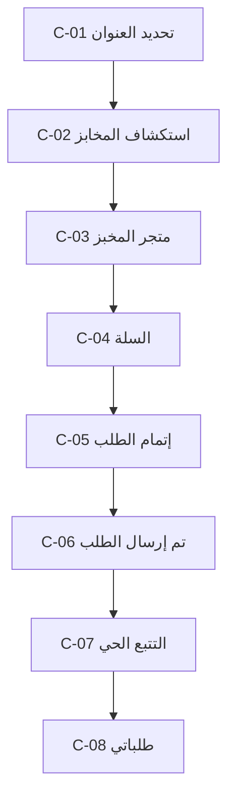
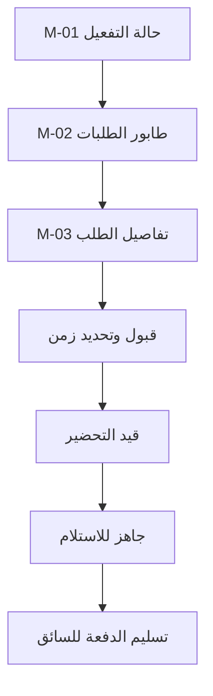
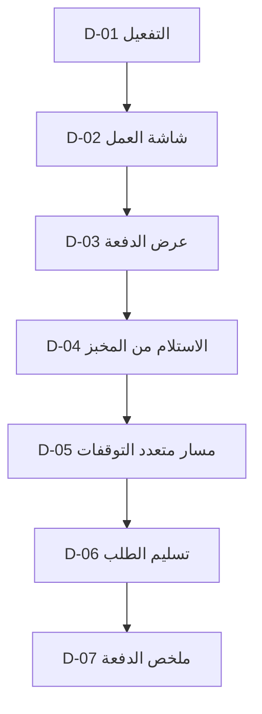
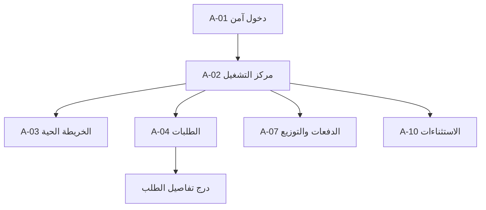
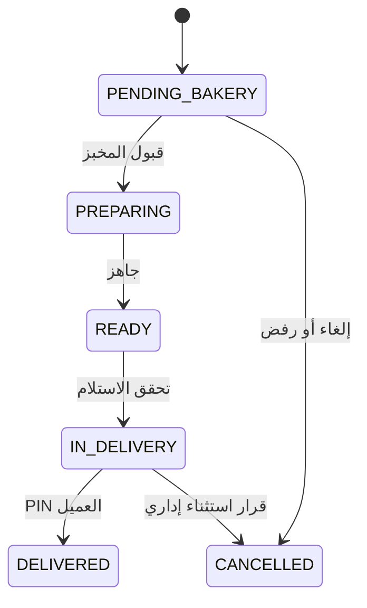
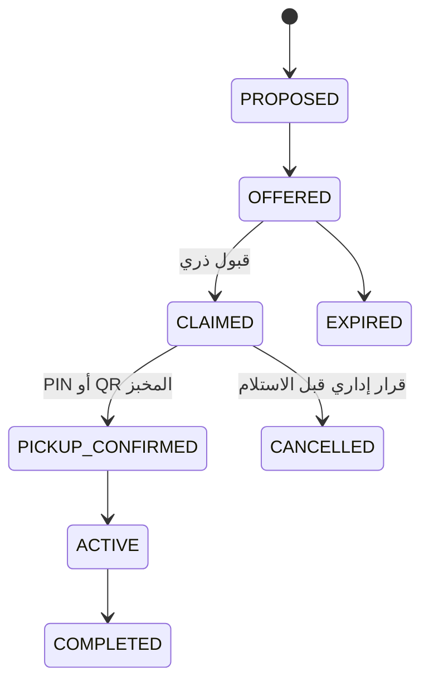
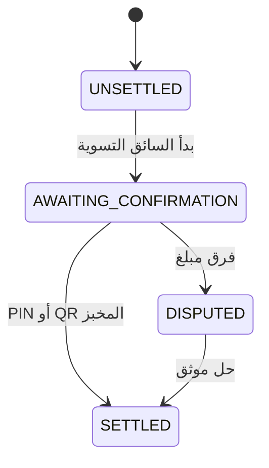

# مخطط شاشات منصة التوصيل المحلية — MVP المخابز

**الإصدار:** 1.0  
**التاريخ:** 5 آب 2026  
**الواجهات:** تطبيق العميل، تطبيق المخبز/البائع، تطبيق السائق، لوحة الإدارة على الويب

## 1. القرار التنفيذي

الإصدار الأول منصة توصيل محلية داخل **حي واحد** وتبدأ بـ **المخابز فقط**. البنية قابلة لإضافة الخضروات والأسواق والمواد الإنشائية لاحقاً، لكن واجهات الطيار لا تعرض فئات غير متاحة.

حدود الـMVP:

- العربية هي اللغة الأساسية مع دعم الإنجليزية وRTL/LTR.
- متجر واحد لكل طلب.
- الدفع عند الاستلام فقط، بالدينار العراقي ومن دون كسور.
- السائق ينفّذ دفعة من طلب واحد إلى ثلاثة طلبات من المخبز نفسه، والخادم هو الذي ينشئ الدفعة.
- تصفح العميل مسموح قبل تسجيل الدخول؛ التحقق بالهاتف مطلوب عند إتمام أول طلب.
- تطبيق العميل والبائع يعملان على الهاتف والويب بتخطيط متجاوب.
- تطبيق السائق Mobile-first؛ الويب يدعم الحساب والسجل والنقد، أما رحلة التوصيل الحية فتحتاج الهاتف لضمان GPS والعمل بالخلفية والكاميرا.
- لوحة الإدارة Desktop-first على الويب.
- Mobbin مرجع للأنماط فقط؛ التصميم النهائي أصلي ومكيّف للعراق وضعف الاتصال.

## 2. حجم المخطط

| المجموعة | مسارات P0 للإطلاق | مسارات P1 بعد استقرار الطيار | ملاحظات |
|---|---:|---:|---|
| مصادقة مشتركة للموبايل | 2 | 0 | رقم الهاتف ثم OTP، يعاد استخدامهما في التطبيقات الثلاثة |
| العميل | 9 | 2 | خريطة/قائمة، متجر، سلة، إتمام، تتبع وحساب أساسي |
| المخبز/البائع | 8 | 2 | الطلبات، المنتجات، المبيعات والتسوية |
| السائق | 9 | 1 | العمل، الدفعة، الاستلام، التوصيل، النقد والحساب |
| الإدارة | 11 | 2 | التشغيل، الشركاء، التوزيع، COD والاستثناءات |
| **الإجمالي** | **39** | **7** | 46 مساراً عند اكتمال P1 |

هذه أعداد **المسارات** وليست عدد التصاميم الفريدة؛ كثير من القوائم، التفاصيل، الحالات والألواح يعاد استخدامها.

## 3. المصادقة المشتركة

| الرمز | الشاشة | الهدف | الانتقال الأساسي |
|---|---|---|---|
| G-01 | إدخال رقم الهاتف | تعريف المستخدم مع اختيار رمز البلد تلقائياً للعراق | G-02 |
| G-02 | التحقق برمز OTP | إدخال الرمز، إعادة الإرسال، تعديل الرقم | الوجهة التي بدأ منها المستخدم |

قواعد المصادقة:

- العميل يتصفح من دون حساب، ثم يظهر G-01 عند تأكيد الطلب.
- البائع والسائق يبدآن دائماً بالمصادقة، ثم تظهر حالة التفعيل أو الرفض إن وجدت.
- دخول الإدارة مستقل: بريد/كلمة مرور قوية مع MFA، وليس تدفق الهاتف المشترك.
- الحظر، كثرة المحاولات، انتهاء الرمز، وانقطاع الشبكة حالات داخل الشاشتين وليست صفحات جديدة.

## 4. تطبيق العميل

### التنقل

شريط سفلي من ثلاث وجهات: **استكشف — طلباتي — حسابي**. يظهر العنوان الحالي أعلى الاستكشاف، ويُحفظ تبديل الخريطة/القائمة كحالة داخل الشاشة.

### مسارات P0

| الرمز | الشاشة | ما ينجزه العميل | الانتقالات |
|---|---|---|---|
| C-01 | تحديد عنوان التوصيل | إذن الموقع، تحريك الدبوس، كتابة نقطة دالة ورقم هاتف | C-02 أو العودة إلى C-05 |
| C-02 | استكشاف المخابز | خريطة وقائمة بديلة، مخابز مفتوحة/مغلقة، وقت ومسافة ورسوم تقريبية، بحث وفلاتر بسيطة | C-03، C-08، C-11 |
| C-03 | متجر المخبز | معلومات المخبز، الأقسام، المنتجات، التوفر، إضافة سريعة للسلة | لوحة خيارات المنتج، C-04 |
| C-04 | السلة | تعديل الكمية، حذف، ملاحظة للمخبز، ملخص المنتجات والتوصيل | C-03 أو C-05 |
| C-05 | إتمام الطلب | العنوان، رقم الاتصال، COD واضح، مراجعة نهائية، إجمالي بالدينار | G-01/G-02 عند الحاجة، ثم C-06 |
| C-06 | تم إرسال الطلب | رقم الطلب، المبلغ النقدي، الزمن المتوقع، CTA واحد للتتبع | C-07 |
| C-07 | التتبع وتفاصيل الطلب | خط زمني للحالة، المخبز والسائق، الخريطة بعد الاستلام، رمز التسليم، المبلغ المطلوب | C-08 أو مساعدة/مشكلة |
| C-08 | طلباتي | الطلب النشط أولاً ثم الطلبات السابقة ببطاقات واضحة | C-07 للطلب النشط، C-09 للسابق |
| C-11 | الحساب والإعدادات والمساعدة | الاسم والهاتف، اللغة، الإشعارات، الخصوصية، الدعم وتسجيل الخروج | C-10 أو شاشة الدعم المدمجة |

### مسارات P1

| الرمز | الشاشة | السبب |
|---|---|---|
| C-09 | إيصال وتفاصيل طلب سابق | مراجعة البنود والحركات وإعادة الطلب لاحقاً |
| C-10 | العناوين المحفوظة | المنزل والعمل ونقطة دالة؛ يمكن بدء الطيار بعنوان أخير واحد |

### حالات وليست صفحات

- البحث والفلاتر داخل C-02.
- تبديل الخريطة/القائمة داخل C-02؛ على الويب يظهران معاً في تخطيط منقسم.
- خيارات المنتج والكمية في Bottom Sheet من C-03.
- تأكيد حذف عنصر، تغيير المخبز، أو مغادرة السلة في Dialog.
- نفاد المنتج أو تغير السعر يظهر كمراجعة إلزامية داخل C-04/C-05؛ لا يُعدّل الطلب بصمت.
- خارج منطقة الخدمة، المخبز مغلق، الموقع مرفوض، لا توجد نتائج، وضعف الشبكة حالات مدمجة.

## 5. تطبيق المخبز/البائع

### التنقل

شريط سفلي: **الطلبات — المنتجات — المبيعات — المتجر**. على الويب تتحول قائمة الطلبات وتفاصيل الطلب إلى عمودين.

### مسارات P0

| الرمز | الشاشة | ما ينجزه البائع | الانتقالات |
|---|---|---|---|
| M-01 | حالة التفعيل | تفعيل/قيد المراجعة/موقوف مع سبب وخطوة الدعم | M-02 عند التفعيل |
| M-02 | طابور الطلبات | تبويبات جديد، تحضير، جاهز؛ عداد زمني وتنبيه طلب جديد | M-03 |
| M-03 | تفاصيل وتنفيذ الطلب | مراجعة البنود، قبول أو رفض بسبب، تحديد زمن، بدء التحضير، وضع «جاهز»، تسليم للسائق | يعود إلى M-02 |
| M-04 | قائمة المنتجات | بحث، أقسام، سعر، متوفر/نافد، ترتيب بسيط | M-05 |
| M-05 | إضافة/تعديل منتج | الاسم العربي والإنجليزي، صورة، السعر، القسم، التوفر | M-04 |
| M-06 | سجل المبيعات | الطلبات المسلّمة، قيمة المنتجات، رسوم/عمولة، ما تم تحصيله وما هو مستحق | M-07 أو M-09 |
| M-07 | تفاصيل التسوية | الحركات، المبلغ المستحق، تأكيد استلام نقد من السائق بـPIN/QR، إيصال | M-06 |
| M-08 | حالة المتجر وإعداداته | مفتوح/متوقف مؤقتاً، ساعات العمل، مدة التحضير الافتراضية، بيانات الفرع | يعود إلى الصفحة السابقة |

### مسارات P1

| الرمز | الشاشة | السبب |
|---|---|---|
| M-09 | سجل الطلبات | بحث وتصفية الطلبات المكتملة والملغاة والمرفوضة |
| M-10 | الحساب والمساعدة | المستخدمون المخولون، اللغة، الإشعارات، الدعم وتسجيل الخروج |

### حالات وليست صفحات

- تنبيه الطلب الجديد Overlay قابل للوصول ولا يفتح تفاصيله تلقائياً أثناء تنفيذ طلب آخر.
- القبول، رفض مع سبب، تحديد زمن التحضير، و«جاهز» حالات داخل M-03.
- وضع منتج «نافد اليوم» Quick Action من M-04، مع تعديل كامل في M-05.
- تأكيد تسليم الطلبات للسائق Sheet يعرض أرقامها؛ لا يسمح بتسليم طلب غير جاهز.
- عند انقطاع الشبكة تبقى القراءة من آخر مزامنة، لكن القبول والرفض والجاهزية والتسوية تتطلب إقرار الخادم.

## 6. تطبيق السائق

### التنقل

شريط سفلي: **العمل — السجل — النقد — الحساب**. عند وجود دفعة نشطة تصبح الرحلة شاشة كاملة، ويُمنع قبول دفعة متعارضة.

### مسارات P0

| الرمز | الشاشة | ما ينجزه السائق | الانتقالات |
|---|---|---|---|
| D-01 | التسجيل/التفعيل | بيانات السائق والمركبة، حالة KYC، سبب الرفض أو النقص | D-02 عند التفعيل |
| D-02 | شاشة العمل | متصل/غير متصل، الخريطة، الدفعات المتاحة، حالة GPS والاتصال | D-03 |
| D-03 | عرض دفعة | مخبز واحد، 1–3 طلبات، المسافة، الزمن، وجهات تقريبية، الأجرة المتوقعة، مهلة القبول | D-04 عند قبول موثق |
| D-04 | الاستلام من المخبز | الوصول، قائمة الطلبات، مطابقة رقم/QR، تأكيد كل طلب والمبلغ النقدي المطلوب | D-05 |
| D-05 | مسار الدفعة | التوقف الحالي والتالية، ترتيب الخادم، فتح تطبيق الخرائط، تقدم الدفعة | D-06 لكل توقف |
| D-06 | تفاصيل وتسليم التوقف | عنوان ونقطة دالة، اتصال محمي، مبلغ COD، PIN/QR، إثبات الاستلام، الإبلاغ عن مشكلة | D-05 أو D-07 |
| D-07 | ملخص اكتمال الدفعة | المسلّم/المتعذر، النقد المحصل، أجرة السائق، المستحق للمخبز | D-08 أو D-02 |
| D-08 | سجل COD والتسويات | النقد بعهدة السائق، مستحق كل مخبز، تسويات PIN/QR، الإيصالات | تفاصيل حركة داخل الشاشة |
| D-10 | الحساب والمركبة والإعدادات | حالة التفعيل، المستندات، المركبة، اللغة، الإشعارات، الدعم وتسجيل الخروج | D-01 عند تعليق الحساب |

### مسارات P1

| الرمز | الشاشة | السبب |
|---|---|---|
| D-09 | سجل الدفعات | الرحلات السابقة والطلبات والوقت والمبالغ |

### حالات وليست صفحات

- الاتصال بالعميل/المخبز، سبب التعذر، إبلاغ مشكلة، تأكيد النقد، والتقاط الإثبات Sheets داخل D-06.
- لا يختار السائق ثلاث طلبات يدوياً؛ يعرض D-03 دفعة متوافقة أنشأها الخادم.
- لا نبني ملاحة منعطفاً بمنعطف في الـMVP؛ D-05 يفتح تطبيق الخرائط ويبقي ترتيب التوقفات والحالة داخل التطبيق.
- تغيير ترتيب التوقفات، تجاوز نقطة، أو إنهاء من دون PIN/QR يحتاج سبباً وصلاحية خادم.
- بعد إدخال PIN صحيح أثناء انقطاع مفاجئ، يمكن عرض `بانتظار المزامنة` محلياً بمعرّف فريد؛ لا تُغلق الدفعة ولا يُثبت السجل المالي قبل ACK الخادم، ويمنع تكرار التحصيل.

## 7. لوحة الإدارة على الويب

### التنقل

قائمة جانبية: **نظرة عامة — الخريطة الحية — الطلبات — الدفعات — المخابز — السائقون — النقد — التسويات — الاستثناءات — الإعدادات**.

### مسارات P0

| الرمز | الشاشة | ما ينجزه المشرف | التفاصيل المدمجة |
|---|---|---|---|
| A-01 | دخول آمن | بريد، كلمة مرور، MFA، استرداد مضبوط | رسائل الحظر والجلسة المنتهية |
| A-02 | مركز التشغيل | أرقام الطلبات حسب الحالة، تأخيرات، سائقون متصلون، نقد غير مسوّى | فلاتر الوقت والحي |
| A-03 | الخريطة الحية | المخابز والسائقون والطلبات النشطة مع طبقات اختيارية | درج كيان من الخريطة |
| A-04 | الطلبات | جدول سريع بفلاتر الحالة والمخبز والسائق والزمن | درج تفاصيل، خط زمني، إجراءات موثقة |
| A-05 | المخابز | قائمة واعتماد/إيقاف، بيانات الفرع وساعات العمل والتسويات | درج ملف المخبز |
| A-06 | السائقون | قائمة وحالة العمل وKYC والمركبة والدفعات والنقد بالعهدة | درج ملف السائق |
| A-07 | الدفعات والتوزيع | دفعات مقترحة/معروضة/مقبولة، إعادة تعيين موثقة، مراقبة السعة | درج الدفعة |
| A-08 | سجل COD | كل حركة نقدية، العهدة، مستحق المخبز، أجرة السائق، عمولة المنصة | درج الحركة؛ تصحيح عكسي فقط |
| A-09 | التسويات | تسويات مفتوحة/مكتملة/متنازع عليها، مطابقة PIN/QR | إيصال وتسلسل الموافقات |
| A-10 | طابور الاستثناءات | تأخير، عدم توفر، تعذر تسليم، فرق نقدي، شكوى | تعيين مالك، أولوية، قرار وسبب |
| A-11 | إعدادات التشغيل | حدود الحي، رسوم التوصيل، ساعات الخدمة، حد الدفعة=3، قوالب الأسباب | نشر نسخة إعدادات مدققة |

### مسارات P1

| الرمز | الشاشة | السبب |
|---|---|---|
| A-12 | المستخدمون والصلاحيات وسجل التدقيق | فصل الأدوار وتتبع كل إجراء إداري |
| A-13 | التقارير والتصدير | المبيعات والتوصيلات والتأخير والفروقات بصيغة CSV/PDF |

### حالات وليست صفحات

- تفاصيل الطلب، المخبز، السائق، الدفعة والحركة المالية تظهر في Drawer يحافظ على الفلاتر، مع URL ثابت قابل للمشاركة والفتح المباشر.
- الموافقة، الإيقاف، إعادة التعيين، الإلغاء أو التصحيح تحتاج Dialog يطلب سبباً ثم تسجّل في Audit Log.
- لا يوجد حذف لحركة مالية. التصحيح يولّد حركة عكسية مرتبطة بالأصل.
- الخريطة ليست الشاشة الوحيدة للتشغيل؛ كل كيان قابل للوصول من جدول عند ضعف بيانات الموقع.

## 8. آلات الحالة المشتركة

لا نضع التنفيذ والتوزيع والنقد في حقل واحد. المصدر الوحيد للحقيقة في الخادم يتكون من **ثلاث آلات حالة منفصلة**؛ كل تطبيق يركّب منها النص المناسب. هذا يمنع انفجار الحالات ويجعل إعادة توزيع سائق أو تسوية النقد ممكنة من دون تغيير معنى حالة الطلب.

### 8.1 حالة الطلب

| `order.status` | نص العميل | البائع | السائق | الإدارة |
|---|---|---|---|---|
| PENDING_BAKERY | بانتظار تأكيد المخبز | طلب جديد مع عداد | لا يظهر | يراقب SLA |
| PREPARING | قيد التحضير | مدة التحضير وزر «جاهز» | لا يظهر | يراقب التأخير |
| READY | جاهز ونبحث عن سائق، أو السائق متجه للمخبز عند وجود تعيين | قائمة جاهز | يظهر ضمن دفعة | غير معيّن/معيّن حسب التوزيع |
| IN_DELIVERY | طلبك في الطريق | تم التسليم للسائق | محطات الدفعة | تتبع حي واستثناءات |
| DELIVERED | تم التسليم مع إيصال | عملية بيع مكتملة | نقد محصل | مكتمل |
| CANCELLED | أُلغي مع سبب مفهوم | مرفوض/ملغي | يزال من المهمة بقرار الخادم | ملغي مع السبب الكامل |

الاستثناء بعد الاستلام لا يصبح حالة طلب جديدة. يسجل كـ`exception: OPEN/RESOLVED` مع نوع مثل «العميل غير متاح» أو «العنوان غير واضح»، ويبقى الطلب `IN_DELIVERY` حتى تعيد الإدارة المحاولة أو تلغيه بقرار موثق.

### 8.2 حالة دفعة التوصيل

- الخادم ينشئ الدفعة فقط من 1–3 طلبات `READY` في الفرع نفسه.
- سائق واحد ودفعة نشطة واحدة في الطيار؛ القبول ذري للدفعة كاملة ولا توجد مربعات لاختيار طلبات منها.
- `DRIVER_ASSIGNED` ليس `order.status`؛ يستنتج من دفعة `CLAIMED`.
- الاستلام يثبت المبالغ والترتيب وينقل طلبات الدفعة إلى `IN_DELIVERY`.
- لا يُعاد تركيب الدفعة بعد قبولها؛ أي تعذر يعالج كاستثناء موثق.

### 8.3 حالة التسوية المالية

- `SETTLED` ليست حالة طلب ولا تعرض للعميل؛ طلبه يظل `DELIVERED`.
- فرق المبلغ لا يغيّر الرصيد يدوياً، بل يفتح نزاعاً ويعالَج بحركة عكسية/تعويضية مرتبطة بالأصل.
- التسوية قد تضم عدة طلبات مسلّمة من المخبز نفسه مع إيصال يربط كل الحركات.

### حراس الانتقال

- `PLACE_ORDER`: سلة من مخبز واحد، عنوان داخل النطاق، مخبز مفتوح، نسخة سعر/توفر حديثة، COD، وidempotency key.
- `ACCEPT_ORDER`: من `PENDING_BAKERY` فقط مع مدة تحضير و`expectedVersion`.
- `REJECT_ORDER`: من `PENDING_BAKERY` فقط مع سبب إلزامي؛ انتهاء مهلة القبول يلغيه آلياً بالسبب نفسه.
- `MARK_READY`: من `PREPARING` فقط.
- `CLAIM_BATCH`: سائق فعّال ومتصل وضمن السعة، وانتقال ذري يمنع سائقين من قبول الدفعة نفسها.
- `CONFIRM_PICKUP`: جميع طلبات الدفعة `READY` والتحقق بـPIN/QR المخبز.
- `CONFIRM_DELIVERY`: طلب `IN_DELIVERY` وPIN العميل؛ ينشئ حركة COD غير قابلة للحذف.
- العميل يلغي فقط قبل قبول المخبز؛ بعده يفتح طلب مساعدة/استثناء.
- أي انتقال قسري من الإدارة يحتاج صلاحية وسبباً وسجل تدقيق.

## 9. حالة النقد COD

| المرحلة | الحدث | ما يسجل في الدفتر |
|---|---|---|
| غير محصل | إنشاء الطلب | إجمالي متوقع فقط؛ لا توجد عهدة نقدية |
| محصل من العميل | تأكيد التسليم بـPIN/QR | نقد بعهدة السائق + مستحق المخبز + أجرة السائق + عمولة المنصة (صفر في الطيار إن تقرر ذلك) |
| بانتظار التسوية | نهاية الدفعة/الوردية | رصيد السائق تجاه كل مخبز |
| مسوّى | تأكيد المخبز PIN/QR | حركة تسوية وإيصال للطرفين |
| تصحيح | فرق أو خطأ موثق | حركة عكسية مرتبطة بالأصل؛ لا تعديل ولا حذف |

## 10. الأحداث العابرة بين التطبيقات

| الحدث | العميل | المخبز | السائق | الإدارة |
|---|---|---|---|---|
| العميل يؤكد C-05 | C-06 ثم C-07 | طلب جديد في M-02 | — | صف جديد في A-04 |
| المخبز يقبل ويحدد الزمن | تحديث C-07 | M-03 تحضير | — | تحديث A-04 |
| المخبز يضع «جاهز» | تحديث الزمن | M-02 جاهز | دفعة مؤهلة في D-02 | تظهر في A-07 |
| السائق يقبل الدفعة | اسم/وصول السائق في C-07 | بيانات السائق في M-03 | D-04 | الدفعة مقبولة في A-07 |
| السائق يستلم | الخريطة والتقدم في C-07 | الطلب في التوصيل | D-05 | تحديث A-03/A-04 |
| السائق يسلم ويحصّل COD | C-07 مكتمل | حركة بيع في M-06 | D-07/D-08 | حركة في A-08 |
| المخبز يؤكد التسوية | لا تغيير | إيصال في M-07 | إيصال في D-08 | مكتمل في A-09 |

قواعد الإشعارات:

- كل إشعار يفتح الكيان الحالي بواسطة `orderId` أو `batchId` أو `settlementId`؛ لا ينشئ مسار شاشة جديداً.
- Push تنبيه وليس مصدر حقيقة. عند الفتح يجلب التطبيق الحالة الحالية، مع polling احتياطي عند تعطل البث الحي.
- يمنع التكرار بواسطة `eventId`: طلب جديد للمخبز، قبول/رفض للعميل، دفعة جاهزة للسائقين المؤهلين، اقتراب السائق للعميل، واستثناء فوري للإدارة.
- تعرض معلومات السائق والعميل بالحد الأدنى اللازم، ولا تكشف الأسباب الداخلية الحساسة للطرف الآخر.

## 11. الحالات العامة المطلوبة لكل شاشة

| الحالة | السلوك المطلوب |
|---|---|
| تحميل | Skeleton يحافظ على شكل الشاشة ولا يغيّر مواضع العناصر |
| فارغ | تفسير واضح وCTA مناسب، لا مجرد «لا توجد بيانات» |
| خطأ قابل للإعادة | رسالة مفهومة وزر إعادة محاولة يحافظ على إدخال المستخدم |
| Offline | شريط ثابت، وقت آخر مزامنة، قراءة آمنة من الكاش، وتعطيل العمليات التي تحتاج إقراراً |
| صلاحية مرفوضة | شرح السبب وبديل يدوي؛ العنوان يكتب يدوياً إن رفض GPS |
| تعارض | عرض التغيير الجديد من الخادم قبل تكرار العملية |
| نجاح | تأكيد قصير ثم انتقال واحد واضح، من دون شاشات احتفالية زائدة |
| انتهاء جلسة | حفظ المسودة الآمنة ثم G-01/G-02 والعودة إلى الموضع السابق |

معايير مشتركة:

- مبالغ مثل `١٢٬٥٠٠ د.ع` من دون كسور.
- أهداف لمس لا تقل عن 44×44، تباين نصي واضح، ودعم تكبير الخط.
- أرقام الطلبات قابلة للنسخ، والحالات لا تعتمد على اللون وحده.
- الهاتف لا يُكشف مباشرة بين الأطراف؛ الاتصال يمر عبر قناة محمية أو وسيط.
- الكتالوج وآخر حالة طلب يمكن قراءتهما من الكاش، لكن checkout والقبول والتسليم والتسوية تحتاج اتصالاً.
- كل طلب كتابة يحمل idempotency key لمنع طلب أو تحصيل مكرر عند إعادة المحاولة.

## 12. ما لا يدخل في مخطط MVP

- الدفع الإلكتروني، المحفظة، الاشتراكات، الكوبونات، الإكراميات والولاء.
- سلة من عدة متاجر أو عدة فروع.
- اختيار السائق طلبات منفردة لتكوين دفعة بنفسه.
- مزايدة السائقين أو تسعير لحظي.
- نظام ملاحة داخلي منعطفاً بمنعطف.
- دردشة كاملة؛ يكفي اتصال محمي ورسائل حالة قصيرة.
- تقييمات ومراجعات عامة، قصص، عروض ضخمة أو Feed تسويقي.
- تحليلات BI متقدمة أو إدارة مدن متعددة.
- عرض أصناف البائعين المستقبلية قبل تشغيلها فعلياً.

## 13. سجل مراجع Mobbin المختارة

| القرار | المرجع | النمط المأخوذ | ما نرفضه/نكيّفه |
|---|---|---|---|
| اكتشاف المخبز | [Lyft Map](https://mobbin.com/screens/f4108c45-5c8b-4a05-841b-815d73f93f27) | خريطة بسيطة وبطاقة كيان محدد | لا نقل هوية أو طلب رحلة؛ نضيف قائمة بديلة وعنواناً عراقياً |
| متجر المخبز | [Instacart Store](https://mobbin.com/screens/ccfb095d-459a-4113-a597-7f0216a41b0b) | أقسام واضحة وسلة ثابتة | نزيل العروض والاشتراكات ونقلل كثافة المحتوى |
| COD Checkout | [Gojek Cash](https://mobbin.com/screens/bc627793-25ea-4a7d-8ea2-75547300b451) | وسيلة الدفع واضحة قبل التأكيد | لا محفظة ولا تبديل وسائل دفع في الطيار |
| تتبع العميل | [Postmates Tracking](https://mobbin.com/screens/1a682178-2bc8-4fa2-942d-784f5463333d) | خط زمني وحالة سائق | نستخدم العربية، نقطة دالة، PIN ومبلغ COD |
| قبول طلب المخبز | [Instacart Order Acceptance](https://mobbin.com/flows/b2e65361-2208-4e17-bc46-7546d924823a) | قرار سريع ومعلومات كافية | القبول لا يكون من إشعار من دون فتح التفاصيل |
| تنفيذ طلب المخبز | [Shopify Order Flow](https://mobbin.com/flows/e1bdbde2-50a2-40b3-95fd-4fced1c57343) | خط زمني وإجراءات واضحة | نقلل التفاصيل التجارية غير اللازمة للمخبز |
| سجل المبيعات | [Fresha History](https://mobbin.com/flows/d28e54af-febb-47e7-b147-2382d0ee9320) | سجل بسيط قابل للبحث | نضيف عهدة COD وتسوية PIN/QR |
| عرض دفعة السائق | [DoorDash Offer](https://mobbin.com/flows/0270b3f2-4ab0-4cd3-9799-74a653c2c2a8) | مسافة وزمن وأجرة قبل القبول | الخادم يجمع طلبات المخبز نفسه فقط |
| تنفيذ التوصيل | [DoorDash Delivery](https://mobbin.com/flows/ec82d267-a98a-4124-bb3b-3de97f76132a) | خطوات استلام وتسليم صريحة | COD وPIN إلزاميان ولا ننسخ النصوص/الأصول |
| التوقفات المتعددة | [Grab Driver Stops](https://mobbin.com/flows/d28b1cfa-d25b-413e-ab85-d7e6d2acb39e) | ترتيب واضح للتوقفات | لا يسمح بتغيير ترتيب الخادم بلا سبب |
| جدول الطلبات | [Shopify Orders](https://mobbin.com/flows/fc099556-4cf1-4002-8fab-c8e78fc54e97) | فلاتر وجدول وتفاصيل | تفاصيل الطلب Drawer بدل فقدان موضع الجدول |
| خريطة الإدارة | [Felt Map](https://mobbin.com/screens/58a17ddb-ae85-48cf-96d8-aa8c632517d7) | طبقات وخريطة تشغيل | الجداول تبقى بديل التشغيل الرئيسي |
| مطابقة النقد | [Wave Reconciliation](https://mobbin.com/screens/008bb53e-daf2-4770-9a9f-b8d1aa1a656a) | وضوح الحركات والمطابقة | دفتر غير قابل للحذف وتصحيح بحركة عكسية |

## 14. ترتيب تصميم الـwireframes

1. **C-02 استكشاف المخابز**: يثبت نموذج الخريطة/القائمة والعنوان.
2. **C-03 متجر المخبز**: يثبت الكتالوج والإضافة للسلة.
3. **C-05 إتمام الطلب**: يثبت COD والعنوان والمراجعة.
4. **C-07 التتبع الحي**: يثبت الحالة المشتركة للطلب.
5. **M-02 وM-03**: طابور الطلب وتنفيذه عند المخبز.
6. **D-03 إلى D-06**: الدفعة والاستلام والتوقفات والتسليم.
7. **A-02 وA-04 وA-08**: التشغيل والطلبات والنقد.

لا يبدأ التصميم البصري أو اختيار الألوان والخطوط قبل اعتماد أول أربعة wireframes نصية للعميل؛ فهذه الرحلة هي التي تثبت المكونات والحالات المستخدمة لاحقاً في بقية المنتجات.
